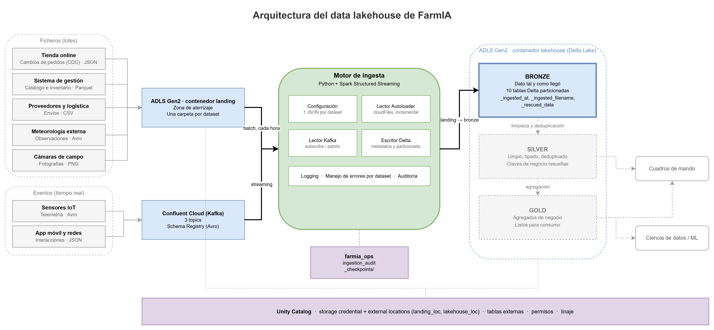
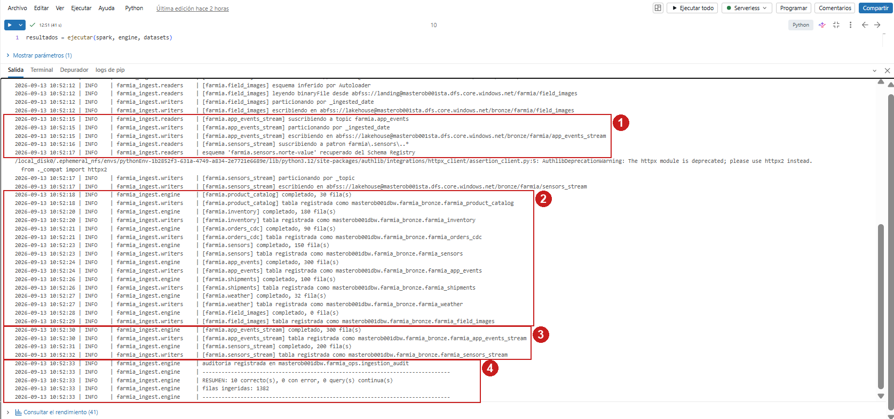
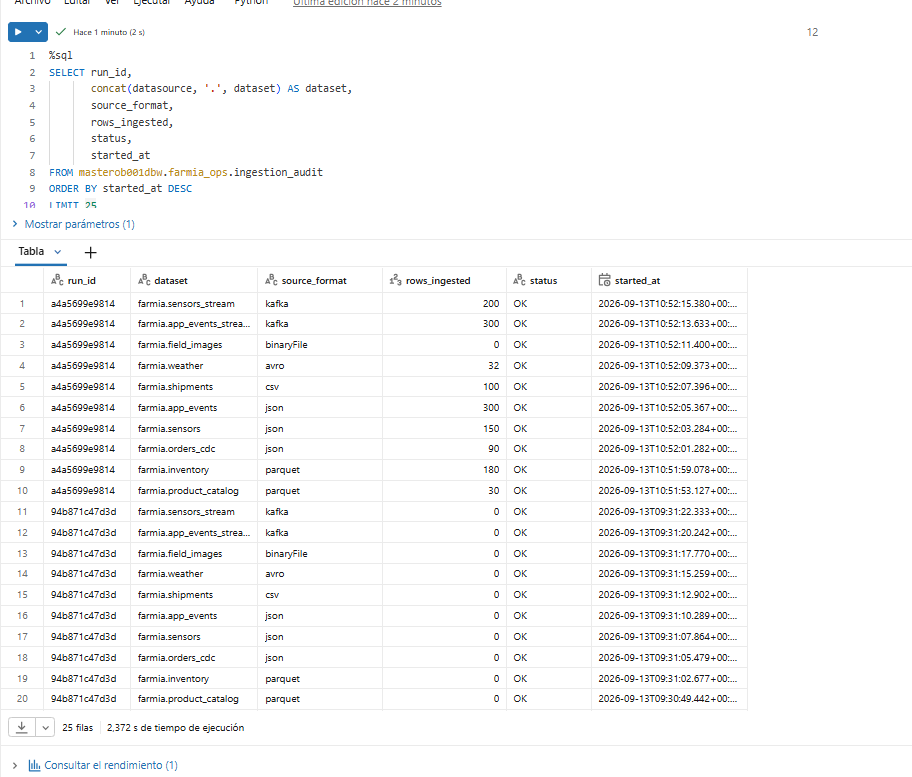

# Arquitectura del data lakehouse de FarmIA

Diseño de la ingesta y del lago de datos
Oskar Brodzik

---

## 1. Punto de partida

FarmIA vende productos agrícolas y prevé triplicar su volumen de datos en dos años. Hoy tiene una tienda en línea y un sistema de inventario local. Mañana necesita integrar seis fuentes que no se parecen entre sí:

| Fuente | Naturaleza | Frecuencia | Formato |
|---|---|---|---|
| Ventas online | Cambios sobre pedidos (CDC) | Continua, se entrega por lotes | JSON |
| Inventario y catálogo | Extracciones del sistema de gestión | Diaria | Parquet |
| Sensores IoT de campo | Eventos de telemetría | Tiempo real | Avro sobre Kafka |
| Eventos de app y redes | Interacciones de usuario | Tiempo real | JSON sobre Kafka |
| Proveedores y logística | Ficheros de envíos | Diaria | CSV |
| Meteorología externa | Observaciones de un proveedor | Diaria | Avro |

A esto se suman las fotografías de cultivo, que son ficheros binarios y no encajan en ninguna tabla.

Esa heterogeneidad es el problema real. No es el volumen: son seis contratos distintos, seis cadencias distintas y dos paradigmas (lotes y tiempo real) que hay que servir con una sola plataforma.

## 2. Por qué un lakehouse

Las dos arquitecturas clásicas resuelven la mitad del problema cada una.

Un **data warehouse** da transacciones, esquemas fiables y buen rendimiento SQL, pero obliga a definir la estructura antes de cargar. Con sensores que pueden añadir un campo nuevo en cualquier despliegue, y con imágenes que no son tabulares, esa rigidez se paga cara.

Un **data lake** admite cualquier cosa porque almacena ficheros, pero sin transacciones ni control de esquema. Dos procesos escribiendo a la vez dejan lecturas parciales, y nadie garantiza que el fichero de ayer tenga las mismas columnas que el de hoy.

El **lakehouse** conserva el almacenamiento barato y abierto del lago, y le añade sobre los ficheros una capa transaccional. En esta implementación esa capa es **Delta Lake**, que sobre cada carpeta de Parquet mantiene un registro ordenado de las operaciones (el *transaction log*). De ahí salen tres propiedades que el lago no tiene:

- **Atomicidad**: una escritura se ve entera o no se ve. Un lector nunca observa una ingesta a medias.
- **Versionado**: cada commit es una versión consultable. Se puede leer la tabla tal como estaba hace tres horas, y auditar qué escribió cada ejecución.
- **Evolución de esquema controlada**: añadir una columna es una operación registrada, no un accidente.

Se elige Delta por integración: es el formato nativo de Databricks, y Unity Catalog y Autoloader están construidos sobre él.

## 3. Visión general



*Figura 1. Arquitectura completa. El borde grueso de Bronze indica lo implementado. Silver y Gold aparecen en gris y con borde discontinuo porque están diseñadas pero quedan fuera del alcance de esta implementación.*

El dato recorre siempre el mismo camino: llega a una zona de aterrizaje, se copia sin transformar a la primera capa del lakehouse, y de ahí asciende ganando estructura y calidad en cada salto. Cada capa tiene un contrato distinto sobre qué garantiza a quien la consulta.

## 4. Las capas

### 4.1 Landing: la zona de aterrizaje

Es un contenedor de almacenamiento separado (`landing`) donde los sistemas de origen depositan sus ficheros. No es todavía parte del lakehouse: aquí no hay tablas, ni esquema, ni garantías. Solo ficheros tal y como los generó quien los produjo.

Tiene una regla: **el motor de ingesta lee de aquí, pero nunca escribe**. Landing pertenece a los sistemas de origen, y separarla del lakehouse permite dar permisos de escritura a terceros sin exponer nada más.

Su organización es una carpeta por dataset:

```
abfss://landing@masterob001sta.dfs.core.windows.net/farmia/
    product_catalog/     inventory/      orders_cdc/
    sensors/             app_events/     shipments/
    weather/             field_images/FIELD-NORTE/2026-04-02/
```

Las imágenes se organizan por campo y fecha porque en los ficheros binarios la ruta *es* metadato: el nombre de la carpeta dice a qué parcela y a qué día corresponde la foto.

### 4.2 Bronze: el histórico fiel

Bronze es la primera capa del lakehouse y guarda **el dato tal y como llegó**, convertido a Delta pero sin limpiar, sin deduplicar y sin reinterpretar. Si el origen mandó un precio negativo, en bronze hay un precio negativo.

Esa disciplina parece contraintuitiva y es deliberada: bronze es la única copia que permite reconstruir las capas superiores cuando se descubre un error de lógica seis meses después. Si se corrige el dato al entrar, ese margen de maniobra desaparece.

Lo único que se añade son metadatos de procedencia:

| Columna | Contenido | Para qué |
|---|---|---|
| `_ingested_at` | Momento de la ingesta | Ordenar cargas y particionar por día |
| `_ingested_filename` | Fichero de origen | Rastrear una fila hasta su fichero |
| `_ingested_filepath` | Ruta completa | Recuperar el contexto de la carpeta |
| `_rescued_data` | Campos que no encajan con el esquema | Ver el dato anómalo sin perderlo |
| `_topic`, `_partition`, `_offset` | Coordenadas del mensaje en Kafka | Trazabilidad de eventos |

La columna `_rescued_data` merece una nota. Cuando un fichero trae un campo inesperado o un tipo que no cuadra, Autoloader no descarta la fila ni detiene la ingesta: mete lo que no encaja en esa columna. El dato anómalo queda disponible para investigarlo, y la ingesta sigue.

### 4.3 Silver: el dato de trabajo

Silver es donde el dato se vuelve utilizable. Aquí sí se limpia, se tipa, se deduplica y se resuelven las claves de negocio: el CDC de pedidos se consolida en el estado actual de cada pedido, las lecturas de sensores se validan contra rangos plausibles, y las tablas se cruzan entre sí por `sku` o `field_id`.

Es la capa que consume un analista o un modelo de machine learning. Una fila por entidad, tipos correctos, integridad garantizada.

### 4.4 Gold: el dato de negocio

Gold contiene agregados orientados a una pregunta concreta: ventas por canal y semana, tiempos medios de entrega por proveedor, humedad media por parcela y día. Son tablas pequeñas, desnormalizadas y rápidas de consultar, pensadas para alimentar cuadros de mando.

### 4.5 Ops: la capa de operación

Junto a las tres capas de datos hay un esquema `farmia_ops` que no contiene datos de negocio sino información sobre el propio funcionamiento del sistema:

- La tabla **`ingestion_audit`**, donde el motor escribe una fila por dataset y ejecución: identificador de ejecución, filas escritas, duración, estado y mensaje de error si lo hubo.
- Los **checkpoints** de las consultas de streaming, que se guardan en `_checkpoints/` dentro del contenedor del lakehouse.

Esta capa es la que permite responder a "¿por qué faltan datos de ayer?" sin leer logs.

**Alcance**: el motor implementado cubre el tramo landing → bronze. Silver y Gold se describen porque la arquitectura debe estar completa, y sus esquemas están creados en el catálogo, pero su implementación queda fuera.

## 5. Organización del almacenamiento

Dos contenedores en la misma cuenta de Azure Data Lake Storage Gen2:

```
landing/     zona de aterrizaje, escriben los sistemas de origen
lakehouse/   bronze/  silver/  gold/  _checkpoints/
```

La cuenta tiene activado el **espacio de nombres jerárquico**, lo que convierte las carpetas en directorios reales en vez de prefijos simulados. Sin eso, renombrar o borrar una carpeta con muchos ficheros sería una operación costosa.

### Particionado

Cada tabla de bronze se particiona por la columna por la que se filtra habitualmente. Es una decisión por dataset, declarada en su configuración:

| Tabla | Particionada por | Motivo |
|---|---|---|
| `inventory` | `warehouse_id` | Las consultas de silver filtran por almacén |
| `weather` | `station_id` | Las series se analizan por estación |
| `sensors` | `field_id` | El análisis agronómico es por parcela |
| `sensors_stream` | `_topic` | Cada topic corresponde a una zona |
| El resto | `_ingested_date` | Sin columna natural, se agrupa por día de carga |

El particionado no es gratis: divide la tabla en carpetas, y elegir una columna con demasiados valores distintos genera miles de ficheros diminutos, lo que degrada la lectura más de lo que la mejora el filtrado. Por eso ninguna tabla se particiona por identificadores como `sku` o `order_id`.

`_ingested_date` es un caso particular: no viene en el dato, se calcula en el momento de escribir a partir de `_ingested_at`. El motor permite declarar estas columnas derivadas en la configuración.

## 6. Gobierno: Unity Catalog

El almacenamiento guarda ficheros. El catálogo les da nombre, permisos y trazabilidad.

La conexión entre ambos se hace con tres piezas encadenadas:

1. Un **Access Connector**, que es una identidad gestionada de Azure a la que se concede el rol de escritura sobre la cuenta de almacenamiento.
2. Una **storage credential** en Unity Catalog, que apunta a esa identidad.
3. Dos **external locations**, `landing_loc` y `lakehouse_loc`, que autorizan el acceso a rutas concretas usando esa credencial.

La ventaja frente al método clásico de configurar la clave de la cuenta en el cluster es que **ninguna credencial viaja al código ni a la configuración de cómputo**. El permiso vive en el catálogo, se concede por ruta y se audita de forma centralizada.

Sobre esa base, el motor registra cada tabla de bronze como tabla externa:

```
masterob001dbw.farmia_bronze.farmia_orders_cdc
masterob001dbw.farmia_bronze.farmia_sensors_stream
...
```

Externa significa que el catálogo guarda la definición y los permisos, pero los ficheros siguen en la ruta de ADLS que decidió el motor. Borrar la tabla no borra los datos.

## 7. Flujo de ingesta

El motor de ingesta es una aplicación Python dirigida por configuración: un fichero JSON por dataset describe de dónde se lee, en qué formato y dónde se escribe, y el código no contiene nada específico de ningún dataset. Su detalle está en el README. Aquí interesa cómo encaja en la arquitectura.

### 7.1 Ficheros: Autoloader

Los ocho datasets de fichero se leen con **Databricks Autoloader**, que resuelve un problema concreto: saber qué ficheros son nuevos desde la última ejecución.

La alternativa ingenua es listar el directorio y comparar con lo ya procesado, que deja de funcionar cuando hay decenas de miles de ficheros. Autoloader mantiene ese registro en su checkpoint, de modo que cada ejecución horaria procesa solo lo que ha llegado.

Esto se comprobó en la práctica: tras la carga inicial, se depositó una segunda tanda de ficheros y la siguiente ejecución ingirió exactamente las filas nuevas de cada dataset, sin reprocesar ninguna anterior.

### 7.2 Eventos: Kafka

Los dos datasets de streaming consumen de un cluster de **Confluent Cloud**.

Uno se suscribe a un topic concreto. El otro usa un **patrón** (`farmia\.sensors\..*`), de forma que al dar de alta una zona de cultivo nueva basta con crear su topic: el motor lo recoge en la siguiente ejecución sin tocar la configuración.

Los mensajes de sensores viajan en **Avro** con su esquema registrado en el **Schema Registry**. El productor no incrusta el esquema en cada mensaje, sino un identificador, y el consumidor lo resuelve contra el registro. Eso reduce el tamaño de los mensajes y, sobre todo, permite evolucionar el esquema con garantías de compatibilidad.

Un detalle de implementación que conviene documentar: Confluent antepone a cada mensaje cinco bytes de cabecera, un byte de control y cuatro con el identificador del esquema. Hay que descartarlos antes de decodificar el contenido Avro. Si no se hace, la deserialización falla o devuelve nulos.

### 7.3 Una sola API para los dos casos

Tanto la lectura de ficheros como la de Kafka se hacen con **Structured Streaming**. Esto no es casual: al unificar ambos caminos bajo la misma API, la escritura, los checkpoints, el registro de tablas y la auditoría son idénticos para batch y para tiempo real. El motor no tiene dos mitades, tiene dos lectores y un único camino de salida.

## 8. Decisiones de infraestructura

### 8.1 Cómputo serverless

El diseño original contemplaba un cluster clásico de Databricks. No fue posible: la suscripción disponible (Azure for Students) tiene cuota cero de vCPU en todas las familias de máquina que Databricks admite, y las solicitudes de ampliación se deniegan.

La alternativa adoptada es **cómputo serverless** con acceso al almacenamiento vía external locations de Unity Catalog. Esto tiene dos consecuencias de diseño:

- La configuración clásica de la clave de cuenta en el cluster deja de aplicar. Las rutas `abfss://` se usan directamente y el permiso lo resuelve el catálogo. Es, de hecho, la práctica recomendada hoy.
- Para escribir ficheros binarios desde Python se necesita un **volumen externo** de Unity Catalog, que monta una ruta de ADLS en el sistema de ficheros local del entorno.

### 8.2 Trigger

En serverless, las consultas de streaming se ejecutan con `Trigger.AvailableNow`: procesan todo lo pendiente y terminan, en lugar de quedarse activas indefinidamente.

Para los ficheros esto es exactamente lo que se quiere, y coincide con el requisito de ejecutar el motor cada hora. Para Kafka supone que la ingesta no es continua sino de latencia acotada por la frecuencia de ejecución.

El motor soporta ambos modos: si un dataset declara `trigger.processing_time`, se crea una consulta continua que queda activa y el motor informa de ello sin esperarla. Sobre la infraestructura disponible esa rama no se puede ejercitar, pero la limitación es del entorno, no del diseño.

## 9. Validación del motor

Las capturas siguientes corresponden a una ejecución real del motor sobre la infraestructura descrita.

### 9.1 Ejecución completa



*Figura 2. Una sola ejecución procesando los diez datasets.*

**(1)** Suscripción al topic `farmia.app_events` y al patrón `farmia\.sensors\..*`, con el esquema Avro recuperado del Schema Registry.

**(2)** Ingesta incremental de los ocho datasets de fichero. Cada uno recoge únicamente las filas de los ficheros llegados desde la ejecución anterior. `field_images` reporta cero porque no recibió ninguna imagen nueva, lo que confirma que Autoloader no reprocesa lo ya ingerido.

**(3)** Ingesta de los dos datasets de eventos: 300 mensajes JSON del topic suscrito directamente y 200 en Avro repartidos entre los dos topics que resuelve el patrón.

**(4)** Auditoría registrada y resumen de la ejecución: diez datasets correctos, 1382 filas, ningún error.

### 9.2 Registro de auditoría



*Figura 3. Contenido de `farmia_ops.ingestion_audit` tras varias ejecuciones.*

Cada ejecución queda identificada por un `run_id` y deja una fila por dataset con el formato de origen, las filas escritas, el estado y la marca de tiempo. En la captura conviven dos ejecuciones: la de las 10:52, que recogió las filas nuevas de cada fuente, y la de las 09:31, que devolvió cero en todas porque no había llegado nada nuevo.

Esta tabla es la que permite responder a preguntas de operación (qué se ingirió, cuándo y con qué resultado) sin tener que revisar los registros de ejecución del cómputo.

---

## Bibliografía

Databricks. *What is Auto Loader?* https://docs.databricks.com/ingestion/auto-loader/

Databricks. *What is Unity Catalog?* https://docs.databricks.com/data-governance/unity-catalog/

Delta Lake. *Delta Lake documentation*. https://docs.delta.io/

Confluent. *Schema Registry and wire format*. https://docs.confluent.io/platform/current/schema-registry/fundamentals/serdes-develop/
